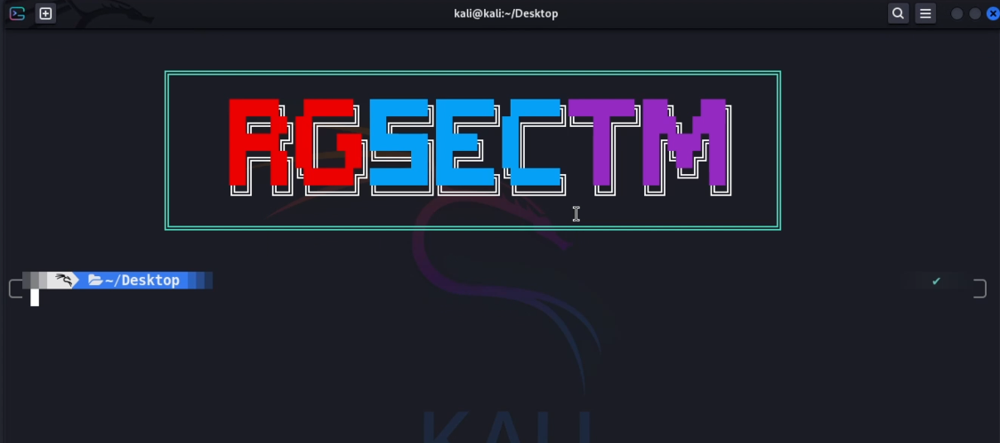
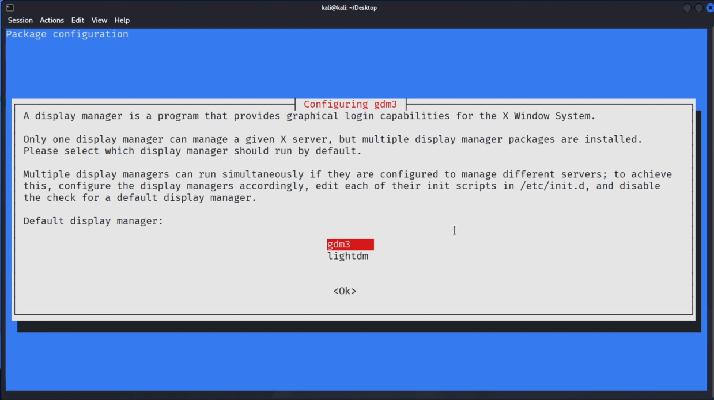

<div align="center">

# Linux customization

<br/>



<br/>

>kali linux customization of the `GNOME` desktop environment, 
>installing the vibrant `Candy Icon` pack, adding smooth extensions, 
>and completely upgrading the terminal using the powerful `OhMyZsh shell` with essential plugins.
>And adding a unique `ascii banner`.

</div>

<br/>

## Install GNOME environment

install `GNOME` useing this command

```bash
sudo apt install kali-desktop-gnome
```
Select `gdm3` as the display manager when installing GNOME.



## Install Candy Icons

Install `Candy icons` useing this command

```bash
mkdir ~/.icons
```

```bash
git clone https://github.com/EliverLara/candy-icons.git ~/.icons/candy-icons
```

## Download kali all Wallpapers

Download kali all wallpapers useing this commands

```bash
sudo apt update && sudo apt install kali-wallpapers-all kali-wallpapers-legacy -y
```

## Install and setup OhMyZsh & powerlevel10k

**Open This link : [github.com/techchipnet/p10k](https://github.com/techchipnet/p10k) and follow video tutorial to setup `Powerlevel10k & OhMyZsh`**

## Make Custom Terminal Banner

**Open This link : [patorjk.com](https://patorjk.com/software/taag/) to generate custome banners**

## Colors code

copy the colors code and add colors into your banner.

```bash
red="\033[1;31m"
green="\033[1;32m"
yellow="\033[1;33m"
blue="\033[1;34m"
purple="\033[1;35m"
cyan="\033[1;36m"
white="\033[1;37m"
```

## Video Tutuorial

[](https://www.youtube.com/watch?v=F2320sUPvbI)
